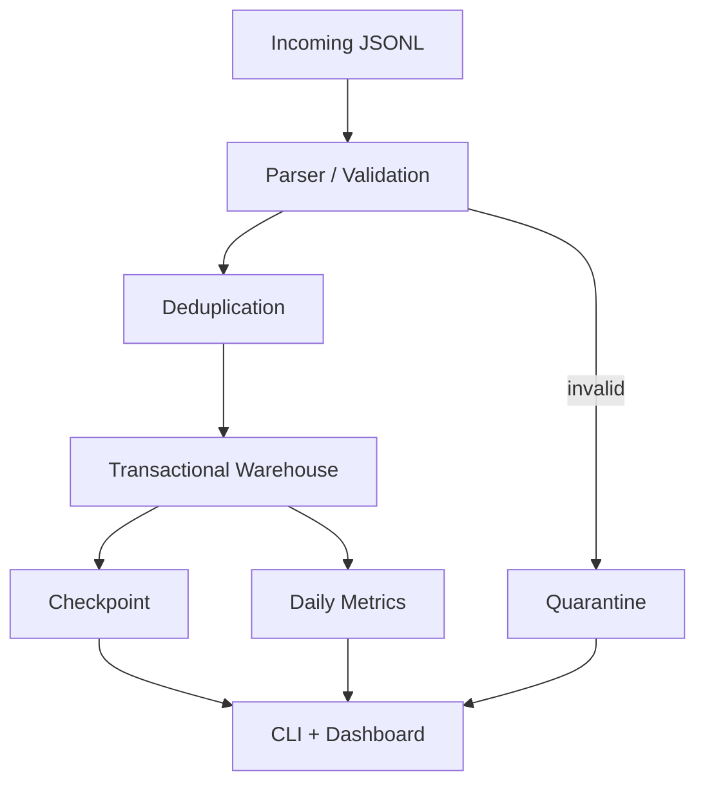

# PipeForge

**Crash-safe incremental ETL** — a production-style coding environment for evaluating whether an agent can repair a realistic data pipeline.

PipeForge receives JSONL product/activity events, loads them into a local SQLite warehouse, and exposes a CLI plus an animated control-center dashboard.

## What capability does this evaluate?

The agent must inspect an unfamiliar multi-file data-engineering repository and repair subtle correctness bugs: incremental ingestion, checkpointing, global deduplication, malformed input, timezones, monetary precision, schema evolution, and crash recovery.

This is software engineering, not an algorithm puzzle.

## Why is the task realistic?

The starting tree looks like a small internal platform: parser, ingest, checkpoint, warehouse, metrics, quarantine, CLI, and a FastAPI dashboard. A single happy-path file succeeds. Failures appear on reruns, duplicates, corrupt lines, interruptions, offsets, cents, extra fields, and late data.

## What is intentionally wrong?

At a high level only: the starting pipeline can double-write on reruns, miss cross-file duplicates, checkpoint too early, leave partial files, abort on one bad line, mishandle timezones and money, reject additive fields, ignore late historical days, and skip a renamed-in-place file by name alone.

Exact repairs are not listed in `task/instruction.md`.

## How the pipeline works



Files land in `data/incoming/`. Eligible files are parsed line by line. Invalid lines go to `quarantine_records`. Valid events are inserted under a per-file transaction. After those writes commit, the file is checkpointed. Daily metrics are UTC date rollups. The CLI and dashboard call the same `run_pipeline` function.

## How is success verified?

Behavioral tests under `tests/` (copied to `/grader/tests` in Docker) check warehouse outcomes: counts, identities, aggregates, quarantine, and crash-rerun equivalence. They do not require exact SQL text or function names.

## Edge cases

Idempotent reruns, in-file and cross-file duplicates, conflicting ids, mixed valid/invalid JSON, missing fields, extra schema fields, UTC midnight boundaries, exact cents, late arrivals, changed-content files, and deterministic failure injection.

## Grader attacks

See `analysis/grader_attacks.md`. The suite blocks hardcoded filenames and counts, local-only dedup, wipe-and-rebuild warehouses, float rounding, timezone stripping, and checkpoint-before-commit shortcuts.

## How do I run it?

```bash
cd environment/repo
python -m pip install -r requirements.txt
python scripts/generate_demo_data.py
python -m pipeline run
python -m pipeline status
```

Reset demo data (not a production CLI command):

```bash
python scripts/reset_demo.py
```

## How do I run the dashboard?

The evaluation surface remains the Python CLI and FastAPI API. The production-style control center is a Next.js app in `frontend/`.

Backend API (required):

```bash
cd environment/repo
python -m pipeline.dashboard
```

Open [http://localhost:8000](http://localhost:8000) for the API and the legacy static page.

Frontend control center:

```bash
cd frontend
npm install
npm run dev
```

Open [http://localhost:3000](http://localhost:3000). Configure the API origin with `NEXT_PUBLIC_PIPEFORGE_API_URL` (default `http://127.0.0.1:8000`).

The Next.js app includes light/dark/system themes, animated pipeline controls, run/file/metric/quarantine explorers, and a command palette (`Ctrl+K` / `Cmd+K`). It never invents warehouse numbers; empty and offline states are shown when the API has no data or is unreachable.

See `frontend/README.md` for routes, environment variables, production build, and troubleshooting.

## Frontend architecture

```text
Next.js control center  →  FastAPI /api/*  →  Python ETL  →  SQLite
```

The frontend is a typed client over existing pipeline functions. FastAPI stays thin. Docker evaluation still runs the Python verifier only; Node is not required to grade ETL correctness.

## How do I run tests?

From this directory, with `PYTHONPATH=environment/repo`:

```bash
python -m pip install -r environment/repo/requirements.txt
python -m pytest -q tests
```

## How do I apply the reference solution?

```bash
python scripts/apply_reference_solution.py
# or: scripts/apply_reference_solution.sh
```

## How do I reset to starting state?

```bash
python scripts/reset_environment.py
# or: scripts/reset_environment.sh
```

## What result should I see before the reference patch?

```bash
python scripts/verify_starting_state.py
# or: scripts/verify_starting_state.sh
```

Infrastructure must work (imports, CLI, simple happy-path ingest). Meaningful reliability tests **fail**. The script prints:

`Starting state fails as expected. Environment is ready for an agent.`

## What result should I see after it?

```bash
python scripts/verify_reference_solution.py
# or: scripts/verify_reference_solution.sh
```

Every verifier test passes.

## Docker

Build from this directory (no Compose, no network services):

```bash
docker build -f environment/Dockerfile -t pipeforge .
docker run --rm pipeforge python -m pipeline status
docker run --rm -p 8000:8000 pipeforge python -m pipeline.dashboard
docker run --rm pipeforge pytest -q /grader/tests
```

Paths inside the image:

- app workdir: `/workspace`
- verifier: `/grader/tests`
- warehouse: `PIPEFORGE_DB_PATH` (default `/workspace/data/warehouse.db`)
- incoming: `PIPEFORGE_INCOMING_DIR`

## Layout

```text
task/                 Agent instruction and task.yaml
environment/repo/     Starting application the agent edits
environment/Dockerfile
frontend/             Next.js control center (Talks to FastAPI)
tests/                Authoritative behavioral verifier
solution/             Reference patch and notes
analysis/             Grader-attack notes and model-run log
scripts/              Reset / apply / verify helpers
```
